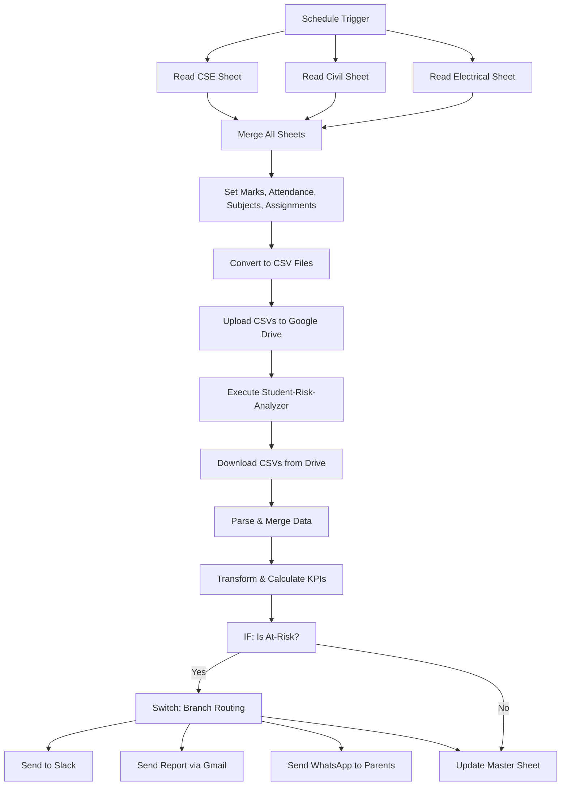

```mermaid
graph TD

%% Workflow 1: Read-&-Upload
Start1[Schedule Trigger] --> ReadCSE[Read CSE Sheet]
Start1 --> ReadCivil[Read Civil Sheet]
Start1 --> ReadElec[Read Electrical Sheet]
ReadCSE --> MergeSheets[Merge All Sheets]
ReadCivil --> MergeSheets
ReadElec --> MergeSheets
MergeSheets --> SetData[Set Marks, Attendance, Subjects, Assignments]
SetData --> ConvertCSV[Convert to CSV Files]
ConvertCSV --> UploadDrive[Upload CSVs to Google Drive]
UploadDrive --> TriggerETL[Execute Student-Risk-Analyzer]

%% Workflow 2: Student-Risk-Analyzer
TriggerETL --> DownloadFiles[Download CSVs from Drive]
DownloadFiles --> ParseData[Parse & Merge Data]
ParseData --> Transform[Transform & Calculate KPIs]
Transform --> CheckRisk[IF: Is At-Risk?]

CheckRisk -->|Yes| NotifySwitch[Switch: Branch Routing]
NotifySwitch --> Slack[Send to Slack]
NotifySwitch --> Gmail[Send Report via Gmail]
NotifySwitch --> Twilio[Send WhatsApp to Parents]
NotifySwitch --> UpdateSheet[Update Master Sheet]

CheckRisk -->|No| UpdateSheet

```
